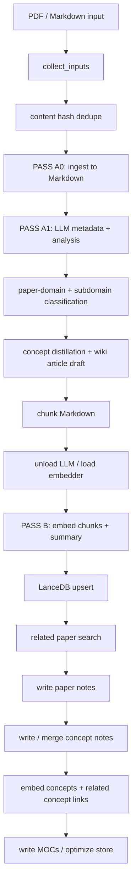
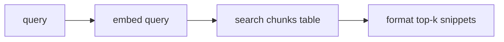
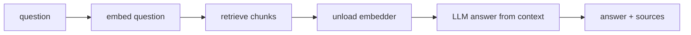
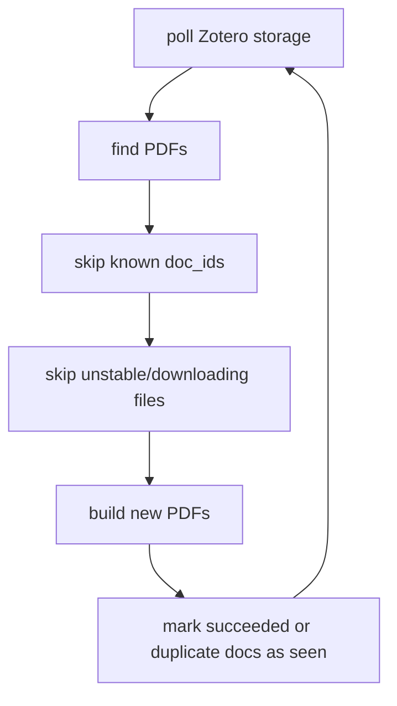

# Data Pipeline

Last reviewed: 2026-07-09

This document summarizes the current PaperRoach data flow: how PDFs and
Markdown notes enter the system, how they are transformed, where derived data is
stored, and which commands maintain the Obsidian knowledge base.

## 1. Purpose

PaperRoach is a local Obsidian knowledge pipeline. It ingests research PDFs
and Markdown notes, extracts structured paper metadata and analysis with Ollama,
embeds the content into LanceDB, and writes linked Obsidian notes.

The pipeline is designed around limited VRAM:

- PASS A uses the LLM model for metadata, analysis, concepts, and prose.
- The LLM is unloaded.
- PASS B uses the embedding model for vector storage and related-link search.

Current local configuration is read from `kb.toml`.

## 2. Main Inputs

| Input | Source | Handler | Output |
|---|---|---|---|
| PDF paper | Manual `paperroach build <pdf>` or Zotero watcher | `kb/ingest.py` | Markdown text |
| Markdown note | Manual `paperroach build <md>` | `kb/ingest.py` | Original note text |
| Zotero metadata | Zotero SQLite DB | `kb/zotero.py` | Better title, authors, year, tags, URL, venue, DOI |
| Existing Obsidian notes | Vault folders | `kb/obsidian.py`, `kb/knowledge.py` | Preserved user notes plus managed blocks |

Supported file suffixes:

- `.pdf`
- `.md`
- `.markdown`

Generated notes are skipped on re-ingest if their frontmatter contains
`kb-generated: true`.

## 3. Main Outputs

| Output | Location | Owner |
|---|---|---|
| Generated paper notes | `<vault>/<references_dir>/<Domain>/<Subdomain>/*.md` | `kb/obsidian.py` |
| Concept notes | `<vault>/<knowledge_library_dir>/<Subject>/*.md` | `kb/knowledge.py` |
| Paper domain metadata | `Domain`, `Subdomain`, `Secondary Domains`, `Contribution Type`, `Methods` frontmatter | `kb/llm.py`, `kb/taxonomy.py` |
| Bibliographic venue metadata | `Venue`, `Venue Type`, `DOI`, `Volume`, `Issue`, `Pages`, `Publisher` frontmatter | `kb/zotero.py`, `kb/obsidian.py` |
| Tag registry | `<vault>/<tags_dir>/Tag Registry.md` | `kb/tags.py` |
| Vector store | `<kb_path>` | `kb/store.py` |
| Content hash ledger | `<kb_path>/content_hashes.json` | `kb/pipeline.py` |
| Watcher lock | `<kb_path>/watch.lock` | `kb/pipeline.py` |
| Watcher log | User-managed terminal or service log | Local watcher wrapper |

By default, `kb.toml` points the store at:

```text
<vault>/.kb
```

## 4. High-Level Flow



## 5. Build Pipeline

The main orchestration lives in `kb/pipeline.py::build`.

### 5.1 Input Discovery

Function:

```text
collect_inputs(paths, config, recursive)
```

Responsibilities:

- Expand files and directories passed to `paperroach build`.
- Filter unsupported suffixes.
- Skip anything inside the KB store.
- Skip generated Markdown notes.
- De-duplicate paths within the same command.

### 5.2 Content Dedupe

Functions:

```text
content_hash_for(source_path)
_dedupe_by_content(...)
```

Responsibilities:

- Compute SHA-1 of source file bytes.
- Skip duplicate PDFs already listed in `content_hashes.json`.
- Skip duplicate files within the same batch.

Important behavior:

- `doc_id` is path-based.
- `content_hash` is byte-content-based.
- The hash ledger prevents the same PDF from being rebuilt from multiple Zotero
  attachment paths.

### 5.3 PASS A0: Ingest

Module:

```text
kb/ingest.py
```

PDF ingestion modes:

| `ingester` | Behavior |
|---|---|
| `pymupdf4llm` | Default PDF to Markdown path |
| `ocr` | Force OCR using `rapidocr-onnxruntime` |
| `nougat` | Math-aware extraction; falls back to `pymupdf4llm` on failure |
| `docling` | Optional higher-quality backend if installed |

Key details:

- Scanned PDFs with no text layer are routed to OCR.
- `nougat` runs as a subprocess and unloads Ollama models first to free VRAM.
- Markdown notes are read directly with tolerant encoding handling.

### 5.4 PASS A1: LLM Extraction

Modules:

```text
kb/llm.py
kb/ollama_client.py
```

Steps:

1. Extract metadata:
   - title
   - authors
   - year
   - summary
   - key contributions
   - methods
   - venue
   - venue type
   - DOI
   - tags

2. Enrich from Zotero if possible:
   - Zotero title/authors/year/tags/URL/venue/DOI/volume/issue/pages/publisher
     override LLM guesses.

3. Extract detailed analysis:
   - TL;DR
   - problem and motivation
   - approach
   - key results
   - strengths and limitations
   - takeaways
   - concepts

4. Classify the paper domain independently from concept folders:
   - `primary_domain`
   - `subdomain`
   - `secondary_domains`
   - `contribution_type`
   - `methods`
   - `evidence`
   - `confidence`

   The classifier uses `kb/taxonomy.py` and asks for the paper's main research
   contribution, not incidental tool keywords. For example, a VR relaxation
   system evaluated with users is filed under `HCI / VR/AR Interaction` even if
   it uses AI-assisted environment generation. A core rendering or geometry
   paper can be filed under `Computer Science / Computer Graphics`.

   Subdomain priority is metadata-first: explicit frontmatter is used first,
   then metadata hints such as tags, venue, DOI/source URL, and title, and only
   then compact body sections such as TL;DR, Approach, and Concepts.

5. Distill concept details:
   - explanation
   - why it matters
   - tags
   - parent concept
   - subject/domain folder

6. Generate wiki-style concept article bodies.

7. Extract display equations and optionally weave them into the Approach prose.

8. Chunk source Markdown with section-aware chunking.

The LLM uses JSON-mode for structured extraction where possible, with a repair
attempt for malformed JSON.

### 5.5 Chunking

Module:

```text
kb/chunk.py
```

Behavior:

- Split Markdown by headings.
- Respect fenced code blocks when fences are balanced.
- Window long sections with overlap.
- Prefix chunks with header context.

Configured by:

```toml
chunk_size = 1200
chunk_overlap = 150
```

### 5.6 Model Swap

Module:

```text
kb/ollama_client.py
```

The pipeline explicitly unloads the LLM before embeddings:

```text
client.unload_llm()
```

This is important because the LLM and embedder may not fit in VRAM together.

### 5.7 PASS B: Embedding and Store Upsert

Module:

```text
kb/store.py
```

For each document:

1. Embed every chunk.
2. Embed the summary.
3. Upsert document metadata into the `docs` table.
4. Replace all chunk rows for the document in the `chunks` table.

LanceDB tables:

| Table | Purpose | Key |
|---|---|---|
| `docs` | One row per source document, summary vector for related-paper search | `doc_id` |
| `chunks` | Chunk text and vectors for search/RAG | `doc_id`, `chunk_index` |
| `concepts` | Concept-note vectors for related-concept links | `concept_id` |

Vector width is checked against `config.embed_dim` when tables are opened.

### 5.8 Related Paper Links

Module:

```text
kb/store.py
kb/obsidian.py
```

For every newly embedded document:

1. Search `docs` by summary vector.
2. Exclude itself.
3. Keep top `related_top_k`.
4. Write links into the generated note's `## Related Papers` block.

Managed markers:

```text
%% kb-related-start %%
%% kb-related-end %%
```

### 5.9 Paper Note Writing

Module:

```text
kb/obsidian.py
```

Generated paper note includes:

- YAML frontmatter
- `Domain` classification metadata
- metadata callout
- TL;DR
- Problem & Motivation
- Approach
- Key Results
- Contributions
- Strengths & Limitations
- Takeaways
- Key Equations, if not integrated
- Concepts
- Mermaid concept map
- Related Papers
- My Notes
- References

User-written text under `## My Notes` is preserved across rebuilds.

### 5.10 Concept Note Writing

Module:

```text
kb/knowledge.py
```

For each extracted concept:

1. Choose a subject/domain folder.
2. Reuse an existing concept note anywhere in the Knowledge Library if the stem
   matches.
3. If the note exists, append a source backlink.
4. If it does not exist, create a new concept note.

Concept notes include:

- `Type: Concept`
- `Subject`
- optional `Parent`
- tags
- article body
- `## Source`
- `# References`

Merge behavior:

- Existing concept notes are not overwritten.
- Generated concept notes may receive new parent/source/related metadata.

### 5.11 Related Concept Links and MOCs

Module:

```text
kb/knowledge.py
kb/organize.py
```

After concept notes are touched:

1. Embed new or changed concept notes.
2. Upsert rows in the `concepts` table.
3. Search semantically similar concepts.
4. Write managed `## Related Concepts` blocks.
5. Add sibling frontmatter links for concepts that share source papers.
6. Refresh generated MOC notes.

Managed concept markers:

```text
%% kb-related-concepts-start %%
%% kb-related-concepts-end %%
```

## 6. Read Pipeline

Read commands live in `kb/rag.py`.

### 6.1 Search

Command:

```bash
paperroach search "query"
```

Flow:



Steps:

1. Unload LLM.
2. Embed query with the embedding model.
3. Search `chunks`.
4. Print top-k results with title, section, score, and snippet.

### 6.2 Ask

Command:

```bash
paperroach ask "question"
```

Flow:



Steps:

1. Unload LLM.
2. Embed query.
3. Retrieve top-k chunks.
4. Unload embedder.
5. Ask LLM to answer using only retrieved context.
6. Return answer plus deduplicated sources.

## 7. Watch Pipeline

Command:

```bash
paperroach watch
```

Module:

```text
kb/pipeline.py::watch
```

Flow:



Behavior:

- Finds Zotero data directory automatically or via `zotero_dir`.
- Polls `storage/*/*.pdf`.
- Skips files already represented by `doc_id`.
- Retries failed PDFs up to 3 attempts.
- Uses `watch.lock` heartbeat to avoid two watcher processes racing.

Optional local startup wrapper:

```text
paperroach-watch.cmd
```

The wrapper usually runs:

```text
python -u -m paperroach watch
```

## 8. Maintenance Commands

| Command | Purpose | Writes? |
|---|---|---|
| `paperroach stats` | Show store counts and model config | No |
| `paperroach gc` | Report orphan/duplicate docs and orphan concepts | No |
| `paperroach gc --apply` | Delete orphan/duplicate store rows and duplicate generated notes | Yes |
| `paperroach relink` | Refresh paper related links and concept related links | Yes |
| `paperroach refile` | Dry-run paper note moves into domain/subdomain folders | No |
| `paperroach refile --apply` | Move generated paper notes, persist inferred filing metadata, and update store note paths | Yes |
| `paperroach retag` | Dry-run paper tag consolidation | No note writes, but calls LLM |
| `paperroach retag --apply` | Rewrite tag registry and paper note tags | Yes |
| `paperroach retag --concepts` | Dry-run concept tag enrichment | No note writes, but calls LLM |
| `paperroach retag --concepts --apply` | Rewrite registry and concept note tags | Yes |
| `paperroach organize` | Dry-run Knowledge Library folder plan | No note moves, but calls LLM |
| `paperroach organize --apply` | Backup library, move concept notes, write MOCs | Yes |
| `paperroach fix-math` | Fix inline math spacing in generated notes | Yes |
| `paperroach integrate-equations` | Weave existing Key Equations into Approach prose | Yes, calls LLM |
| `paperroach wiki` | Rewrite generated concept note bodies as wiki articles | Yes, calls LLM |

## 9. Important Data Identities

### `doc_id`

Defined in `kb/models.py`.

```text
sha1(lowercase absolute source path)[:12]
```

Used for:

- `docs.doc_id`
- `chunks.doc_id`
- build idempotency by source path
- watcher `seen` set

### `content_hash`

Defined in `kb/models.py`.

```text
sha1(file bytes)
```

Used for:

- duplicate content detection
- avoiding duplicate Zotero attachments
- `content_hashes.json`

### `concept_id`

Defined in `kb/knowledge.py`.

```text
sha1(lowercase path relative to vault)[:12]
```

Used for:

- `concepts.concept_id`
- related-concept indexing

Important implication:

- Moving a concept note changes its `concept_id`.
- `relink` or concept processing should run after large Knowledge Library moves.

## 10. Safety Rules and Managed Blocks

Generated files are recognized by frontmatter:

```yaml
kb-generated: true
```

Managed blocks use markers so user content can survive refreshes:

| Block | Markers |
|---|---|
| Related papers | `%% kb-related-start %%` / `%% kb-related-end %%` |
| Related concepts | `%% kb-related-concepts-start %%` / `%% kb-related-concepts-end %%` |
| MOC contents | `%% kb-moc-start %%` / `%% kb-moc-end %%` |
| Tag registry table | `%% kb-tags-start %%` / `%% kb-tags-end %%` |

If a marker pair is missing, duplicated, or out of order, the updater skips the
file rather than partially refreshing a broken managed block.

## 11. Operational Notes

Current observed store state during review:

```text
Documents: 21
Chunks: 1848
Paper notes: 21
Knowledge Library notes: 370
```

Typical always-on processes:

```text
ollama serve
python -u -m paperroach watch
```

Important environment note:

- The Python environment used by the watcher must have the package and PDF
  ingestion dependencies installed.
- Install the package into the active environment before running manual PDF
  builds or long-running watchers.

## 12. Main Failure Boundaries

The pipeline is mostly best-effort: one failed file should not stop the entire
batch. Important boundaries:

- Ingest failure skips that input.
- Analysis failure can still write a thinner note.
- Embedding/store failure skips that document until a later run.
- Note-write failure is logged and the batch continues.
- Watcher retries failed PDFs up to 3 times.
- Store optimization is best-effort and never blocks a build.

Important consistency risk:

- Store upsert and content-hash ledger update happen before paper note writing.
  If note writing fails after storage succeeds, the document may look processed
  even though the Obsidian note was not written. This should be treated as the
  main transactional boundary to improve.

## 13. Module Map

| Module | Role |
|---|---|
| `kb/cli.py` | CLI parser and command dispatch |
| `kb/config.py` | Config loading from CLI, env, `kb.toml`, defaults |
| `kb/pipeline.py` | Build/watch/maintenance orchestration |
| `kb/ingest.py` | PDF and Markdown ingestion |
| `kb/llm.py` | Prompting and structured LLM extraction |
| `kb/taxonomy.py` | Paper-domain taxonomy and fallback classification |
| `kb/ollama_client.py` | Ollama wrapper, JSON parsing, model unload, embeddings |
| `kb/chunk.py` | Header-aware Markdown chunking |
| `kb/store.py` | LanceDB schemas and reads/writes |
| `kb/obsidian.py` | Paper note rendering and managed related-paper blocks |
| `kb/knowledge.py` | Concept note writing, merging, indexing, related concepts |
| `kb/tags.py` | Controlled tag vocabulary and Tag Registry |
| `kb/organize.py` | Knowledge Library folder organization and MOCs |
| `kb/zotero.py` | Zotero storage discovery and metadata enrichment |
| `kb/rag.py` | Semantic search and grounded question answering |

## 14. Recommended Next Improvements

1. Move build success commit after note writing succeeds, or add rollback.
2. Add a global pipeline lock for manual build/maintenance commands, not only
   `paperroach watch`.
3. Add tests for pure functions:
   - filename sanitization
   - frontmatter splitting
   - chunking
   - content dedupe
   - managed block replacement
4. Align `.gitignore` with actual generated artifacts:
   - `.kbstore/`
   - `kb-watch.log*`
   - `kb_backups/`
5. Document the required Python environment for manual commands.
