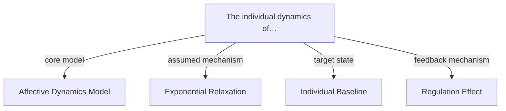

> [!warning] Unreviewed generated output
> This file preserves the actual PaperRoach draft for transparency. It is **not source-verified and should not be cited**. Only local paths and internal IDs were redacted; use the sibling reviewed file for corrected content.
>
> [!info] Attribution
> Adapted from Max Pellert, Simon Schweighofer, and David Garcia, *The individual dynamics of affective expression on social media* (2020), [DOI](https://doi.org/10.1140/epjds/s13688-019-0219-3), © The Author(s) 2020, [CC BY 4.0](https://creativecommons.org/licenses/by/4.0/). A publication warning was added and local-only metadata was redacted where present; see [attribution and changes](../ATTRIBUTION.md).

# The individual dynamics of affective expression on social media
---

> [!info] Metadata
> - **Authors:** Max Pellert, Simon Schweighofer, David Garcia
> - **Year:** 2020
> - **Venue:** EPJ Data Science
> - **DOI:** 10.1140/epjds/s13688-019-0219-3
> - **Link:** https://link.springer.com/article/10.1140/epjds/s13688-019-0219-3

## TL;DR

This paper investigates how individuals' emotional states on social media return to a baseline after expressing emotions, using Facebook status updates as data. It finds that emotional states like valence and arousal exponentially return to individual-specific baselines, and that expressing emotions on social media can regulate these states. These findings are important for affective computing and understanding collective emotions.

## Problem & Motivation

Understanding the dynamics of emotional states is crucial for psychology, affective computing, and social media analysis. Emotional states are known to change over time, but the exact rate and mechanisms of this change, especially in the context of social media, are not well understood. Traditional methods of studying emotions, such as self-reports and lab experiments, have limitations in capturing real-world dynamics. Social media provides a unique opportunity to study emotional expression at scale, but it also presents challenges in accurately interpreting emotional states from text. This study addresses these challenges by analyzing Facebook status updates to model how emotional states evolve over time and how expressing emotions affects these dynamics.

## Approach

### Model Integration and Formalization

The authors propose a computational model of affective dynamics that combines two existing frameworks: the Cyberemotions model and the DynAffect model. This integration is formalized through a set of equations that capture the dynamics of emotional states, such as valence and arousal, over time. Specifically, the model assumes that emotional states exponentially return to an individual-specific baseline after being stimulated. This exponential return is mathematically represented by the differential equation:

$$ \frac{\mathrm{d}x_{i}(t)}{\mathrm{d}t}=-\gamma\left(x_{i}(t)-\mu_{i}\right)+ \xi(t). \tag{2} $$

In this equation, $x_{i}(t)$ denotes the emotional state (valence or arousal) of individual $i$ at time $t$, $\mu_{i}$ represents the individual’s baseline emotional state, $\gamma$ is a decay rate parameter that governs how quickly the emotional state returns to the baseline, and $\xi(t)$ is a stochastic term representing random fluctuations or external influences on the emotional state.

To further formalize the model, the authors derive an expected value equation that captures the average change in emotional states over a discrete time interval $\Delta t$. This is given by:

$$ E\big{[}x_{i}(t+\Delta t)\big{]}=e^{-\gamma\,\Delta t}\big{(}x_{i}(t)-\mu_{i} \big{)}+\mu_{i}. \tag{3} $$

This equation shows that the expected value of the emotional state at time $t + \Delta t$ is a weighted combination of the current state and the baseline, with the weight determined by the exponential decay factor $e^{-\gamma\,\Delta t}$. This formulation is crucial for modeling the gradual return of emotional states to the baseline.

In addition to the baseline return, the model incorporates the idea that expressing emotions—such as posting a Facebook status update—can regulate these states by pushing them toward the baseline. This regulation effect is captured by the equation:

$$ x_{i}(t_{\text{after}})=\left(x_{i}(t_{\text{before}})-\mu_{i}\right)*k+\mu_{i}. \tag{1} $$

Here, $x_{i}(t_{\text{after}})$ and $x_{i}(t_{\text{before}})$ represent the emotional state before and after an expressive event, respectively. The parameter $k$ quantifies the strength of the regulation effect, and $\mu_{i}$ is the individual’s baseline. This equation illustrates how an expressive event can shift the emotional state closer to the baseline, depending on the value of $k$.

To extend the model to discrete time intervals and incorporate both valence and arousal, the authors use the following formulation:

$$ \begin{split} V_{i\tau+\Delta t}&=e^{-\gamma_{\nu} \Delta t}(k_{\nu}*V_{i\tau})+\epsilon_{\nu},\\ A_{i\tau+\Delta t}&=e^{-\gamma_{\nu}\Delta t}(k_{ \nu}*A_{i\tau})+\epsilon_{a},\end{split} \tag{4} $$

In this equation, $V$ and $A$ represent valence and arousal, respectively, $\gamma_{\nu}$ is the decay rate for valence, $k_{\nu}$ is the regulation factor for valence, and $\epsilon_{\nu}$ and $\epsilon_{a}$ are error terms capturing unexplained variability in the model. This formulation allows the model to be applied to discrete time intervals and to account for both valence and arousal dynamics simultaneously.

The authors test this model using a large dataset of Facebook status updates, analyzing the text to quantify valence and arousal. They use statistical methods to estimate the baseline and the regulation factor $k$ for each individual, and they validate the model's assumptions by comparing the predicted dynamics with the observed data.

## Key Results

The study finds that emotional states, quantified as valence and arousal, exponentially return to an individual-specific baseline after being stimulated. On average, the baseline is slightly positive in valence and moderate in arousal, below the midpoint. Expressing emotions (e.g., posting a Facebook status update) immediately pushes valence and arousal toward the baseline by a proportional value. These results are robust across different text analysis techniques and highlight the fast timescale of affective dynamics through social media text. The findings support the core assumptions of the model and have implications for affective computing, collective emotion detection, and psychological research.

## Contributions

- Proposed a unified computational model of affective dynamics combining the Cyberemotions and DynAffect frameworks.
- Empirically validated the model using a large-scale dataset of Facebook status updates.
- Demonstrated that emotional states return to individual-specific baselines after stimulation.
- Showed that expressing emotions on social media can regulate affective states.
- Provided insights into the fast timescale of affective dynamics through social media text.
- Highlighted the potential of social media data for affective computing and psychological research.

## Strengths & Limitations

- **Strengths:** The study uses a large-scale dataset of Facebook status updates, enabling robust statistical analysis; The model is grounded in existing psychological theories and validated with empirical data; The findings are robust to different text analysis techniques, increasing the reliability of the results; The approach provides a new method for studying affective dynamics in real-world settings
- **Limitations & open questions:** The study relies on self-reported or sentiment-analyzed emotional states from text, which may not fully capture the complexity of real emotions; The model assumes exponential relaxation, which may not hold for all individuals or situations; The dataset is limited to Facebook status updates, which may not represent all forms of social media or emotional expression; The study does not account for cultural or contextual differences in emotional expression

## Takeaways

This study demonstrates the power of social media data in modeling and understanding affective dynamics. It shows that emotional states can be quantified and modeled using text analysis, and that expressing emotions can regulate these states. These insights can be applied to affective computing, collective emotion detection, and psychological research, offering new tools for analyzing human emotions in real-world contexts.

## Concepts

- [[Affective Dynamics Model]]
- [[Exponential Relaxation]]
- [[Individual Baseline]]
- [[Regulation Effect]]

## Concept Map

## Related Papers

%% kb-related-start %%
- [[UKPPsycontrol at SemEval-2026 Task 2 Modeling Valence and Arousal Dynamics from Text (2026)]]
- [[Emo-tica at SemEval-2026 Task 2 Trait–State Affect Forecaster for Longitudinal Valence and Arousal (2026)]]
- [[SemEval-2026 Task 2 Predicting Variation in Emotional Valence and Arousal over Time from Ecological Essays (2026)]]
- [[Modeling Emotion in Complex Stories The Stanford Emotional Narratives Dataset (2021)]]
- [[The Emotion Dynamics of Literary Novels (2024)]]
%% kb-related-end %%

## My Notes

---
# References

- Max Pellert et al., "The individual dynamics of affective expression on social media", 2020, EPJ Data Science. doi:10.1140/epjds/s13688-019-0219-3
- https://link.springer.com/article/10.1140/epjds/s13688-019-0219-3
