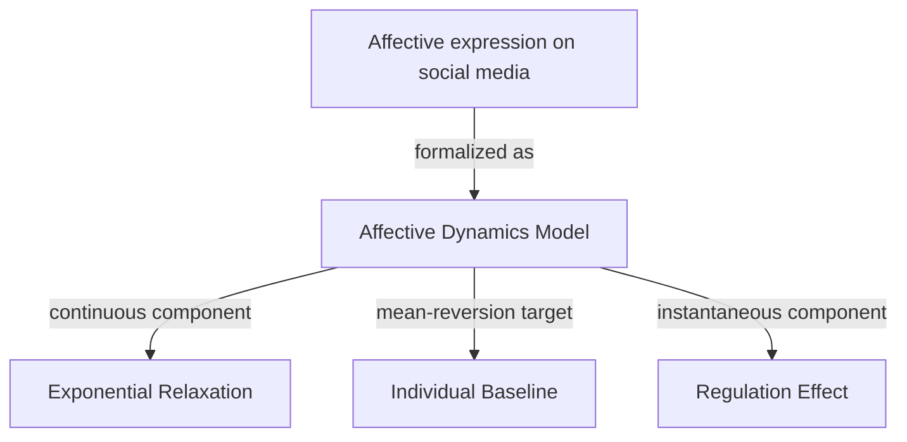

# The individual dynamics of affective expression on social media

> [!note] Public review copy
> This is a source-checked public copy of an actual PaperRoach-generated note. Local paths and internal IDs were removed. Formula transcription, classification, and causal wording were corrected; see the [change log](../CHANGELOG.md). The source paper and this adaptation are available under [CC BY 4.0](https://creativecommons.org/licenses/by/4.0/).

> [!info] Metadata
> - **Authors:** Max Pellert, Simon Schweighofer, David Garcia
> - **Year:** 2020
> - **Venue:** EPJ Data Science 9, article 1
> - **DOI:** [10.1140/epjds/s13688-019-0219-3](https://doi.org/10.1140/epjds/s13688-019-0219-3)

## TL;DR

This paper tests a computational model of affective dynamics using Facebook status updates. In the model, valence and arousal return exponentially toward an individual-specific baseline, while an expressive event is associated with an immediate proportional movement toward that baseline. The fitted patterns are short-lived and robust across two lexicon-based text analysis methods.

## Problem & Motivation

Emotional states change over time, but their relaxation rate, equilibrium point, and relationship to emotional expression are difficult to observe at scale. Repeated self-reports and laboratory studies can interrupt participants or limit sample size. The authors use longitudinal social-media text as a complementary observational trace and ask three questions:

1. How quickly do expressed valence and arousal relax after stimulation?
2. Do people return to a neutral point or to different individual baselines?
3. Is affective expression associated with an immediate movement toward baseline?

## Approach

### Two components of the model

The model combines an instantaneous **expression-associated regulation term** with a continuous **mean-reverting relaxation term**.

For an affective state $x_i$ immediately before and after expression:

$$
x_i(t_{\mathrm{after}})=\left(x_i(t_{\mathrm{before}})-\mu_i\right)k+\mu_i
$$

Here, $\mu_i$ is the individual's baseline and $k$ is the fraction of the baseline-centered state that remains after expression. Values $0<k<1$ represent movement toward the baseline.

Between expressions, the state follows a mean-reverting process:

$$
\frac{\mathrm{d}x_i(t)}{\mathrm{d}t}=-\gamma\left(x_i(t)-\mu_i\right)+\xi(t)
$$

Its expected value after a time interval $\Delta t$ is:

$$
E[x_i(t+\Delta t)]=e^{-\gamma\Delta t}\left(x_i(t)-\mu_i\right)+\mu_i
$$

After subtracting each user's baseline, the fitted valence and arousal models are:

$$
\begin{aligned}
V_{i,t+\Delta t} &= e^{-\gamma_v\Delta t}(k_v V_{i,t})+\epsilon_v,\\
A_{i,t+\Delta t} &= e^{-\gamma_a\Delta t}(k_a A_{i,t})+\epsilon_a.
\end{aligned}
$$

### Data and estimation

- Source dataset: more than 22 million voluntarily donated status updates from 153,727 Facebook users, recorded from 2009 to 2011.
- After preprocessing: 16,863,066 updates from 114,967 users.
- Affect measurement: valence and arousal scores from the WKB lexicon, with NRC-VAD used as an alternative analysis.
- Estimation: weighted nonlinear regression over consecutive status-update pairs, with separate relaxation and regulation parameters for valence and arousal.

## Key Results

- **Individual baselines:** mean valence was 5.88 and mean arousal was 4.13 on the paper's 1–9 scales.
- **Short affective memory:** correlation between consecutive updates first became non-significant after 141 seconds for valence and 129 seconds for arousal.
- **Relaxation:** $\gamma_v=0.0070\,\mathrm{s}^{-1}$ and $\gamma_a=0.0105\,\mathrm{s}^{-1}$; arousal relaxed faster in the fitted model.
- **Expression-associated movement:** $k_v=0.38$ and $k_a=0.45$, leaving roughly 40% of the baseline-centered state immediately after expression in the fitted model.
- **Robustness:** the main pattern remained similar with an alternative affect lexicon and with seasonal corrections.

## Contributions

- Combines assumptions from the Cyberemotions and DynAffect frameworks in one empirically fitted model.
- Tests individual baselines, exponential relaxation, and expression-associated movement using longitudinal text traces.
- Provides calibrated parameter estimates for valence and arousal dynamics at short timescales.
- Demonstrates how large-scale observational text can complement traditional affect research.

## Strengths & Limitations

**Strengths**

- Large longitudinal dataset and status-update-level, unbinned fitting.
- Results checked with two different affect lexicons.
- Explicit model comparison and regression diagnostics.

**Limitations and open questions**

- The model is not a long-horizon sentiment prediction tool.
- Lexicon scores measure affective expression in text, not a direct clinical measurement of internal emotion.
- Facebook users and MyPersonality participants were self-selected, so the sample is not representative of every population or platform.
- Social-media posting is performative and observational; the fitted regulation term should not be read as proof that posting causes emotional recovery.
- External context such as interaction, time of day, and demographic attributes is not included in the model.

## Takeaways

The paper's core contribution is a compact, empirically calibrated description of short-timescale affective expression: people differ in their baselines, consecutive expressions retain a brief memory, and the observed state tends to move toward baseline through an immediate proportional term followed by exponential relaxation. The result is useful as a modeling primitive, but its observational and text-derived nature limits causal or clinical interpretation.

## Concepts

- [[Affective Dynamics Model]]
- [[Exponential Relaxation]]
- [[Individual Baseline]]
- [[Regulation Effect]]

## Concept Map

## My Notes

---

## References

- Pellert, M., Schweighofer, S., & Garcia, D. (2020). *The individual dynamics of affective expression on social media*. EPJ Data Science, 9, 1. https://doi.org/10.1140/epjds/s13688-019-0219-3
- Original article © The Author(s) 2020, licensed under [CC BY 4.0](https://creativecommons.org/licenses/by/4.0/). This reviewed note is an adaptation; changes are documented in the [change log](../CHANGELOG.md).
